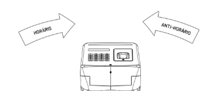
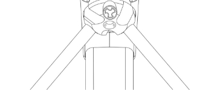



MANUAL DE COMANDOS Toletus LiteNet2  

Firmware V2.1.1 R0 

TOLETUS toletus.com 

SUMÁRIO 

1 INTRODUÇÃO ..................................................................................................................... 4 2 INTERFACE DE COMANDOS........................................................................................... 5 

1. ESTRUTURA DE PACOTES ......................................................................................... 5 
1. LISTA DE COMANDOS ................................................................................................ 5 
1. DETALHES DE COMANDOS ....................................................................................... 8 
1. Funções .................................................................................................................... 8 
1. Libera entrada (0x0001) ................................................................................... 8 
1. Libera saída (0x0002) ....................................................................................... 9 
1. Reinicia (0x0003) ............................................................................................. 9 
1. Mensagem temporária (0x0004) ...................................................................... 9 
1. Notifica usuário (0x0005) .............................................................................. 10 
1. Libera bidirecional (0x0006) .......................................................................... 11 
1. Reset de periférico (0x0007) .......................................................................... 11 
2. Leitura/escrita de configurações ......................................................................... 12 
1. Direção (0x0101, 0x0201) .............................................................................. 12 
1. Controle(0x0102, 0x0202) ............................................................................. 13 
1. Id de dispositivo (0x0103, 0x0203) ................................................................ 14 
1. Configuração de rede (0x0104, 0x0204) ........................................................ 15 
1. Número MAC (0x0105, 0x0205) ................................................................... 15 
1. Mensagem da tela inicial linha 1 (0x0106, 0x0206) ...................................... 16 
1. Mensagem da tela inicial linha 2 (0x0107, 0x0207) ...................................... 16 
1. Modo de tela inicial (0x0108, 0x0208) .......................................................... 16 
1. Silenciar buzzer (0x0109, 0x0209) ................................................................ 17 
1. Tempo de liberação (0x010A, 0x020A) ....................................................... 17 
1. Senha do menu (0x010B, 0x020B) .............................................................. 18 
1. Versão de firmware (0x010C, 0x020C) ........................................................ 18 
1. Número serial (0x010D, 0x020D) ................................................................ 18 
1. Modo de biometria (0x010E, 0x020E) ......................................................... 19 
1. Modo de controle estendido (0x010F, 0x020F) ........................................... 19 
1. Contador de giros (0x0110, 0x0210) ............................................................ 20 
1. Flags de hardware (0x0111, 0x0211) ........................................................... 21 
18. Estados de inicialização (0x0112, 0x0212) .................................................. 21 
3. Notificações ........................................................................................................... 22 
1. Notificação de id com Rfid (0x0301) ............................................................. 22 
1. Notificação de id com código de barras (0x0302) ......................................... 22 
1. Notificação de id com teclado (0x0303) ........................................................ 23 
1. Notificação de passagem pela catraca (0x0304) ............................................ 23 
1. Notificação de timeout de liberação (0x0305) ............................................... 24 
1. Notificação de id com biometria (0x0306)..................................................... 24 
1. Notificação de template de biometria não cadastrado (0x0307) .................... 24 
4. Autenticação ......................................................................................................... 25 
1. Solicitação de desafio de liberação (0x0401) ................................................. 25 
1. Mensagem de desafio 1 (0x0402) .................................................................. 25 
1. Mensagem de desafio 2 (não utilizado) (0x0403) .......................................... 26 
1. Resposta para o desafio (0x0404) .................................................................. 26

14 

1  INTRODUÇÃO 

A comunicação é feita através da interface física de rede ethernet através de um cabo RJ45 através do protocolo TPC/IP em modo IPV4 disponibilizando os seguintes serviços: 

|Porta |Funcionalidade |
| - | - |
|7878 |Interface com a catraca |
|7879 |Interface com o dispositivo de biometria |

Este manual detalha a especificação da interface de comandos com da catraca na porta 7878. Para comunicação direta com dispositivo de biometria, conecte-se com a porta 7879 e utilize os comando disponíveis na documentação do fabricante. 

Versão deste manual. V1.0.22.0131 

2  INTERFACE DE COMANDOS 

Todos os comandos são formatados em pacotes de tamanho constante de 20 bytes. Os seguintes padrões serão seguidos ao longo deste manual, a não ser que explicitamente definido de outra forma: 

- Todos os pacotes serão representados em strings hexadecimais; 
- Conteúdo textual (strings) é codificado em ASCII; 
- Conteúdo numérico com mais de 8 bits é armazenado em  `little-endian`. 
1. ESTRUTURA DE PACOTES 

Todos os pacotes possuem o formato definido abaixo: 

|Prefixo |Identificação de comando |Dados |Sufixo |
| - | - | - | - |
|1 byte |2 bytes |16 bytes |1 byte |

Os campos `Prefixo` e `Sufixo` devem sempre ser os números 83 e 195 respectivamente. Todos os pacotes que violarem esta regra serão ignorados. 

O campo `Identificação de comando` consiste em um numero de 16 bits. A enumeração de todos os comandos é apresentada no capítulo 2.2. 

No campo `Dados` está uma quantidade de argumentos que depende da `Identificação de  comando`.  É  frequente  que  nem  todo  o  espaço  em  `Dados`  seja  esquadrinhado  em argumentos. É boa pratica que este espaço remanescente seja preenchido com zeros. 

2. LISTA DE COMANDOS 

|Descrição |Id. de comando |Direção|Argumentos |||
| - | :- | - | - | :- | :- |
|libera entrada |0x0001 |>placa |texto de 16 caracteres |||
|libera saída |0x0002 |>placa |texto de 16 caracteres |||
|reinicia |0x0003 |>placa ||||
|mensagem temporária |0x0004 |>placa |texto de 16 caracteres |||
|notifica usuário |0x0005 |>placa |Tempo = Numero 2 bytes |Beep= 1 byte |Leds = 1byte |
|libera bidirecional |0x0006 |>placa |texto de 16 caracteres |||
|reset de periférico (biometria) |0x0007 |>placa ||||
|consulta direção |0x0101 |>placa> |numero de 1 byte |||
|consulta controle |0x0102 |>placa> |numero de 1 byte |||
|consulta id de dispositivo |0x0103 |>placa> |numero de 2 bytes |||
|consulta configuração de rede |0x0104 |>placa> |numero de 1 byte |ip = 4 bytes |mascara = 4 bytes |
|consulta numero mac |0x0105 |>placa> |mac = 6 bytes |||
|consulta mensagem da tela inicial linha 1 |0x0106 |>placa> |texto de 16 caracteres |||
|consulta mensagem da tela inicial linha 2 |0x0107 |>placa> |texto de 16 caracteres |||
|consulta modo de tela inicial |0x0108 |>placa> |numero de 1 byte |||
|consulta silenciar buzzer |0x0109 |>placa> |numero de 1 byte |||
|consulta tempo de liberação |0x010a |>placa> |numero de 4 bytes |||
|consulta senha do menu |0x010b |>placa> |texto de 16 caracteres \* |||
|consulta versão de firmware |0x010c |>placa> |4 bytes |||
|consulta numero serial |0x010d |>placa> |numero de 4 bytes |||
|consulta modo de biometria |0x010e |>placa> |numero de 1 byte |||
|consulta modo de controle estendido |0x010f |>placa> |numero de 1 byte |numero de 1 byte ||
|consulta contador de giros |0x0110 |>placa> |numero de 4 bytes |numero de 4 bytes ||
|consulta flags de hardware |0x0111 |>placa> |Campo de 16 bytes |||
|consulta estados de inicialização |0x0112 |>placa> |numero de 2 bytes (extensível) |||
| :- | - | - | - | :- | :- |
|configura direção |0x0201 |>placa |numero de 1 byte |||
|configura controle |0x0202 |>placa |numero de 1 byte |||
|configura id de dispositivo |0x0203 |>placa |numero de 2 bytes |||
|configura configuração de rede |0x0204 |>placa |numero de 1 byte |ip = 4 bytes |mascara = 4 bytes |
|configura numero mac |0x0205 |>placa |mac = 6 bytes |||
|configura mensagem da tela inicial linha 1 |0x0206 |>placa |texto de 16 caracteres |||
|configura mensagem da tela inicial linha 2 |0x0207 |>placa |texto de 16 caracteres |||
|configura modo de tela inicial |0x0208 |>placa |numero de 1 byte |||
|configura silenciar buzzer |0x0209 |>placa |numero de 1 byte |||
|configura tempo de liberação |0x020a |>placa |numero de 4 bytes |||
|configura senha do menu |0x020b |>placa |texto de 16 caracteres \* |||
|configura versão de firmware (não utilizado) |0x020c ||- |||
|configura numero serial (não utilizado) |0x020d ||- |||
|configura modo de biometria |0x020e |>placa |numero de 1 byte |||
|configura modo de controle estendido |0x020f |>placa |numero de 1 byte |numero de 1 byte ||
|configura zero o contador de giros |0x0210 |>placa ||||
|configura flags de hardware |0x0211 |>placa |Campo de 16 bytes |||
|configura estados de inicialização (não utilizado) |0x0212 ||- |||
|notificação de id com rfid |0x0301 |placa> |texto de 16 caracteres \* |||
|notificação de id com código de barras |0x0302 |placa> |texto de 16 caracteres \* |||
|notificação de id com teclado |0x0303 |placa> |texto de 16 caracteres \* |||
|notificação de passagem pela catraca |0x0304 |placa> |1 byte |4 bytes ||
|notificação de timeout de liberação |0x0305 |placa> ||||
|notificação de id com biometria |0x0306 |placa> |numero de 2 bytes |||
|notificação de template de biometria não cadastrado |0x0307 |placa> ||||
3. DETALHES DE COMANDOS 

Os comandos são divididos em 4 seções: 

- Funções; 
- Leitura/escrita de configuração; 
- Notificações; 
- Autenticação. 
1. Funções 
1. Libera entrada (0x0001) 

Libera catraca na direção de entrada com mensagem opcional. As configurações de direção são definidas no capítulo 2.3.2.1. 

Firmware V2.0.0 R0 e posteriores. 

Argumentos: 

\1)  mensagem\. 

` `A  mensagem  deve  ser  codificada  em  ASCII  e  com  no  máximo  16  caracteres  de comprimento. Caso a mensagem não seja desejada, o campo deve ser preenchido com zeros. 

2. Libera saída (0x0002) 

Libera  catraca  na  direção  de saída com  mensagem  opcional.  As  configurações  de direção são definidas no capítulo 2.3.2.1. 

Firmware V2.0.0 R0 e posteriores. 

Argumentos: 

\1)  mensagem\. 

` `A  mensagem  deve  ser  codificada  em  ASCII  e  com  no  máximo  16  caracteres  de comprimento. Caso a mensagem não seja desejada, o campo deve ser preenchido com zeros. 

3. Reinicia (0x0003) 

Reinicialização da catraca. Firmware V2.0.0 R0 e posteriores. 

Argumentos: 

\1)  não há\. 

4. Mensagem temporária (0x0004) 

Define mensagem de notificação de usuário. Relacionado com o comando `Notifica usuário` em 2.3.1.5. 

Firmware V2.1.0 R0 e posteriores. 

Argumentos: 

\1)  mensagem\. 

A  mensagem  deve  ser  codificada  em  ASCII  e  com  no  máximo  16  caracteres  de 

comprimento. 

5. Notifica usuário (0x0005) 

Apresenta uma notificação ao usuário da catraca, com os Parâmetros especificados. Firmware V2.1.0 R0 e posteriores, mais cores a partir de V2.1.1 R0. 

Argumentos: 

1) Duração; 

Número de 16 bits que estabelece por quanto tempo em milissegundos a notificação permanece no painel da catraca. 

2) Toque; 

   Número de 8 bits que estabelece o efeito sonoro emitido pela notificação. 

   TODO: encontrar descrição de toques melhor que RTTTL. 

|Valor |Descrição |
| - | - |
|0 |Sem toque |
|1 |"Beep:d=4,o=6,b=180:16c,8g" |
|2 |"err:d=4,o=4,b=180:f#,32p,f#" |
|3 |"ntf:d=4,o=5,b=180:16a4,16d,32p.,16a4" |

3) Cor; 

Número de 8 bits que define a cor dos leds do painel durante a notificação. Os códigos de cores são definidos conforme a tabela abaixo: 

|Valor |Cor |
| - | - |
|0 |Não muda de cor |
|1 |Vermelho |
|2 |Verde à direita |
|3 |Verde à esquerda |
|4 |Azul |
|5 |Verde dos dois lados |
|6 |Ciano |
|7 |Magenta |
|8 |Amarelo |
| - | - |

4) Mostrar texto. 

Número de 8 bits que define se a mensagem de notificação de usuário (2.3.1.5) deve ser mostrada no painel. 

|Valor |Descrição |
| - | - |
|0 |Não mostra mensagem |
|!= 0 |Mostra mensagem |

6. Libera bidirecional (0x0006) 

Libera um giro da catraca, ou na direção de entrada, ou na direção de saída. Uma mensagem pode ser apresentada opcionalmente. 

Firmware V2.1.0 R0 e posteriores. 

Argumentos: 

\1)  Mensagem\. 

` `A  mensagem  deve  ser  codificada  em  ASCII  e  com  no  máximo  16  caracteres  de comprimento. Caso a mensagem não seja desejada, o campo deve ser preenchido com zeros. 

7. Reset de periférico (0x0007) 

Envia o sinal de `hardware reset` para os periféricos conectados. Este comando reinicia 

- módulo escâner biométrico. 

Firmware V2.1.1 R0 e posteriores. 

Argumentos: 

Não possui. 

2. Leitura/escrita de configurações 

Os  comandos  de  leitura/escrita  de  configuração  permitem  consultar  e  modificar parâmetros que persistem após a catraca ser desligada. Todos os parâmetros possuem comandos de consulta e de modificação: alguns destes parâmetros são `somente leitura`. Comandos de modificação  para  parâmetros  somente leitura são mantidos para manter a consistência da interface, porém tentativas de modificá-los são ignoradas. 

Cada parâmetro possui um par de comandos associado sendo 0x01XX o id de comando para escrita de parâmetros. A leitura correspondente é feita pelo id de comando 0x02XX. 

Os  argumentos,  dentro  de  um  comando  de  leitura  enviado  à  catraca,  podem  ser ignorados. Os comandos de leitura são respondidos pela catraca com um pacote com o mesmo id de comando da leitura, e com os parâmetros devidamente preenchidos de acordo com o formato de argumentos para o comando correspondente. 

Ex.: 

Enviado: 

53 03 01 00 00 00 00 00 00 00 00 00 00 00 00 00 00 00 00 c3 

Recebido: 

53 03 01 5e 00 00 00 00 00 00 00 00 00 00 00 00 00 00 00 c3 

1. Direção (0x0101, 0x0201) 

Define as atribuições de direções de entrada e saída. 

As direções são estabelecidas de acordo com a direção do mecanismo conforme imagem 

abaixo: 

Firmware V2.0.0 R0 e posteriores. 

Argumentos: 

\1)  Direção de entrada\. 

Número de 8 bits que estabelece a atribuição de direção. 

|Valor |Descrição |
| - | - |
|0 |Entrada no sentido horário Saída no sentido anti-horário |
|!= 0 |Entrada no sentido anti-horário Saída no sentido horário |

2. Controle(0x0102, 0x0202) 

Estabelece o controle de permissões de fluxo da catraca. A catraca pode gerenciar a passagem de entrada e saída de maneira independente. Cada uma das direções podem ser configuradas de duas maneiras possíveis: 

- Livre: a catraca está sempre liberada nesta direção; 
- Controlada: a catraca está bloqueada por padrão e pode liberar momentaneamente um 

  único giro a cada comando de liberação (2.3.1.1, 2.3.1.2 e 2.3.1.6). 

ATUALIZAÇÃO: 

A configuração de controle é mantida por retrocompatibilidade. Considere utilizar o modo de controle estendido (2.3.2.15). 

Firmware V2.0.0 R0 e posteriores. 

Argumentos: 

\1)  Modo\. 

Número de 8 bits que estabelece as permissões de fluxo. A configuração de entrada/saída é definida conforme a tabela abaixo: 

|Valor |Descrição |
| - | - |
|0 |Entrada livre Saída livre |
|1 |Entrada controlada Saída livre |
|2 |Entrada livre Saída controlada |
|3 |Entrada controlada Saída controlada |

3. Id de dispositivo (0x0103, 0x0203) 

O  id  de  dispositivo  permite  ao  anfitrião  numerar  cada  catraca  para  facilitar  sua  identificação, em um ambiente com múltiplas catracas. 

Firmware V2.0.0 R0 e posteriores. 

Argumentos: 

\1)  Id\. 

Número de 16 bits. Este número pode ser configurado livremente. 

4. Configuração de rede (0x0104, 0x0204) 

24 

Define as configurações de rede. O modo de endereço IP pode ser dinâmico ou estático. Caso estático, o endereço de IP e a mascara de rede devem ser fornecidos. 

O equipamento é compatível apenas com o protocolo Ipv4. 

Firmware V2.0.0 R0 e posteriores. 

Argumentos: 

1) Modo; 

   Número de 8 bits com valor igual a 0 para IP dinâmico e diferente de 0 para IP estático. 

2) Endereço de IP; 

Número de 32 bits. Cada octeto do endereço IPv4 é armazenado em um byte nas ordens correspondentes. Ex.: 169.254.37.28 ~ 0xA9FE251C. 

3) Mascara. 

   Número de 32 bits. Mascara IPv4 codificada do mesmo modo que o endereço IP. 

NOTA: A modificação deste parâmetro se efetiva apenas depois da reinicialização. 

5. Número MAC (0x0105, 0x0205) 

Número que identifica dispositivo de rede. Firmware V2.0.0 R0 e posteriores. 

Argumentos: 

\1)  numero MAC\. 

Número de 48 bits. 

NOTA: A modificação deste parâmetro se efetiva apenas depois da reinicialização. 

6. Mensagem da tela inicial linha 1 (0x0106, 0x0206) 

Mensagem que aparece na tela inicial da catraca na primeira linha. Firmware V2.0.0 R0 e posteriores. 

Argumentos: 

\1)  mensagem\. 

` `A  mensagem  deve  ser  codificada  em  ASCII  e  com  no  máximo  16  caracteres  de comprimento. 

7. Mensagem da tela inicial linha 2 (0x0107, 0x0207) 

Mensagem que aparece na tela inicial da catraca na segunda linha. Firmware V2.0.0 R0 e posteriores. 

Argumentos: 

\1)  mensagem\. 

` `A  mensagem  deve  ser  codificada  em  ASCII  e  com  no  máximo  16  caracteres  de comprimento. 

8. Modo de tela inicial (0x0108, 0x0208) 

A tela inicial pode apresentar mensagens ou contadores da quantidade de passagem pela catraca em cada direção. 

Firmware V2.0.0 R0 e posteriores. 

Argumentos: 

\1)  Modo\. 

Número de 8 bits. Estabelece o conteúdo da pagina inicial conforme a tabela abaixo: 

|Valor |Descrição |
| - | - |
|0 |Mensagens |
| - | - |
|1 |Contadores |

9. Silenciar buzzer (0x0109, 0x0209) 

É possível silenciar o Buzzer. Esta configuração silencia apenas os sons padrões, os alertas de erro não são silenciáveis. 

Firmware V2.0.0 R0 e posteriores. 

Parâmetros: 

\1)  Silenciar\. 

Número de 8 bits. 

|Valor |Descrição |
| - | - |
|0 |Não silenciar |
|!= 0 |Silenciar |

10. Tempo de liberação (0x010A, 0x020A) 

Quando um comando de liberação (8, 9 e 11) é enviado, a catraca irá permitir uma passagem durante um intervalo de tempo. Ao término deste intervalo, a liberação será suspensa, e a catraca voltará ao comportamento padrão conforme as configurações de fluxo (2.3.2.2 e 2.3.2.15). 

Firmware V2.0.0 R0 e posteriores. 

Argumentos: 

\1)  Duração\. 

Número de 16 bits. Duração do intervalo de liberação em milissegundos. 

11. Senha do menu (0x010B, 0x020B) 

Configuração de senha de acesso ao menu acessado no painel da catraca. Firmware V2.0.0 R0 e posteriores. 

Argumentos: 

\1)  Senha\. 

A senha deve conter até 16 dígitos codificados em ASCII. 

12. Versão de firmware (0x010C, 0x020C) 

Parâmetro somente leitura que informa a versão atual do firmware. Firmware V2.0.0 R0 e posteriores. 

Argumentos: 

1) Versão principal; Número de 8 bits. 
1) Versão secundária; Número de 8 bits. 
1) Versão de correção; Número de 8 bits. 
1) Revisão. 

   Número de 8 bits. 

13. Número serial (0x010D, 0x020D) 

Parâmetro somente leitura que informa o número de série da catraca. Firmware V2.0.0 R0 e posteriores. 

Argumentos: 

\1)  Número de série\. 

Numero de 32 bits. 

14. Modo de biometria (0x010E, 0x020E) 

Configuração de escâner biométrico. Define como o computador interage com o escâner biométrico. O escâner possui um sensor de contato que dispara quando o usuário coloca o dedo. No modo `automático`, é possível interagir com o escâner diretamente, utilizando a placa de controle como uma ponte. No modo `apensas local`, o escâner é controlado apenas pela placa, e possui funcionalidades limitadas. 

Firmware V2.0.0 R2 e posteriores. 

Argumentos: 

\1)  Modo\. 

Numero de 8 bits. 

|Valor |Descrição |
| - | - |
|0 |Automático |
|!= 0 |Apenas local |

15. Modo de controle estendido (0x010F, 0x020F) 

Estabelece o controle de permissões de fluxo da catraca. A catraca pode gerenciar a passagem de entrada e saída de maneira independente. Cada uma das direções podem ser configuradas de três maneiras possíveis: 

- Livre: a catraca está sempre liberada nesta direção; 
- Controlada: a catraca está bloqueada por padrão e pode liberar momentaneamente um único giro a cada comando de liberação (2.3.1.1, 2.3.1.2 e 2.3.1.6). 
- Bloqueada: a catraca impede a passagem nesta direção. 

  Pictogramas indicam os sentidos em que a passagem é permitida com uma seta verde, e 

- sentido em que a passagem é bloqueada, com um `X` vermelho. 

Firmware V2.1.0 R0 e posteriores. 

Argumentos: 

1) Modo; 

   Numero de 8 bits. Configuração conforme tabela abaixo: 

<table><tr><th colspan="1" rowspan="2" valign="top">Valor </th><th colspan="2">Descrição </th></tr>
<tr><td colspan="1">Entrada </td><td colspan="1">Saída </td></tr>
<tr><td colspan="1">0 </td><td colspan="1">Controlada </td><td colspan="1">Liberada </td></tr>
<tr><td colspan="1">1 </td><td colspan="1">Controlada </td><td colspan="1">Bloqueada </td></tr>
<tr><td colspan="1">2 </td><td colspan="1">Controlada </td><td colspan="1">Controlada </td></tr>
<tr><td colspan="1">3 </td><td colspan="1">Liberada </td><td colspan="1">Controlada </td></tr>
<tr><td colspan="1">4 </td><td colspan="1">Bloqueada </td><td colspan="1">Controlada </td></tr>
<tr><td colspan="1">5 </td><td colspan="1">Liberada </td><td colspan="1">Liberada </td></tr>
<tr><td colspan="1">6 </td><td colspan="1">Liberada </td><td colspan="1">Bloqueada </td></tr>
<tr><td colspan="1">7 </td><td colspan="1">Bloqueada </td><td colspan="1">Liberada </td></tr>
<tr><td colspan="1">8 </td><td colspan="1">Bloqueada </td><td colspan="1">Bloqueada </td></tr>
</table>

2) Controle de pictograma. Os pictogramas podem ser ligados/desligados conforme a tabela abaixo: 

<table><tr><th colspan="1" rowspan="2" valign="top">Valor </th><th colspan="2">Descrição </th></tr>
<tr><td colspan="1">Entrada </td><td colspan="1">Saída </td></tr>
<tr><td colspan="1">0 </td><td colspan="1">Ligado </td><td colspan="1">Ligado </td></tr>
<tr><td colspan="1">1 </td><td colspan="1">Ligado </td><td colspan="1">Desligado </td></tr>
<tr><td colspan="1">2 </td><td colspan="1">Desligado </td><td colspan="1">Ligado </td></tr>
<tr><td colspan="1">3 </td><td colspan="1">Desligado </td><td colspan="1">Desligado </td></tr>
</table>

16. Contador de giros (0x0110, 0x0210) 

Este parâmetro registra a quantidade de passagens de entrada e de saída.  Comandos de 

escrita (0x0110) para este parâmetro são tratadas como zeramento. 

Firmware V2.1.0 R0 e posteriores. 

Argumentos: 

1) Contador de entradas; Número de 32 bits. 
1) Contador de saídas. Número de 32 bits. 
17. Flags de hardware (0x0111, 0x0211) 

Estas flags possuem detalhes técnicos de configuração de dispositivos de hardware. A tabela abaixo detalha cada flag. Todas as flags são empacotadas em um vetor de bits. 

<table><tr><th colspan="1" rowspan="2" valign="top">Nome </th><th colspan="1" rowspan="2" valign="top">Posição </th><th colspan="2">Valor </th></tr>
<tr><td colspan="1">0 </td><td colspan="1">1 </td></tr>
<tr><td colspan="1">RDM6300_ALT_PROT </td><td colspan="1">0 </td><td colspan="1">Protocolo padrão </td><td colspan="1">Protocolo alternativo </td></tr>
</table>

Firmware V2.1.1 R0 e posteriores. 

Argumentos: 

\1)  Flags\. 

Vetor de 16\*8 bits. Conjunto de flags de hardware. 

18. Estados de inicialização (0x0112, 0x0212) 

Parâmetro somente leitura que indica o estado de inicialização de cada módulo. Módulos iniciados de maneira bem sucedida possuem flag igual a 1, e possuem flag igual a 0 caso contrário. Todas as flags são empacotadas em um vetor de bits. 

|Nome |Posição |Descrição |
| - | - | - |
|STC\_NETWORK |0 |Dispositivo de rede |
|STC\_SCANNER |1 |Escâner de impressão digital |

Firmware V2.1.1 R0 e posteriores. 

Argumentos: 

\1)  flags\. 

Vetor de 16\*8 bits. 

3. Notificações 

Mensagens de notificação são enviadas para cada evento originado na catraca. Estas mensagens são enviadas automaticamente, sem solicitação prévia. 

1. Notificação de id com Rfid (0x0301) 

Notifica a leitura de uma etiqueta RFID. Firmware V2.0.0 R0 e posteriores. 

Argumentos: 

\1)  Número de identificação\. 

Texto numérico com 16 caracteres em ASCII com o numero da etiqueta lida. 

2. Notificação de id com código de barras (0x0302) 

Notifica a leitura de um cartão com código de barras. Firmware V2.0.0 R0 e posteriores. 

Argumentos: 

\1)  Número de identificação\. 

Texto numérico com 16 caracteres em ASCII com o numero do cartão lido. 

3. Notificação de id com teclado (0x0303) 

Notifica a inserção de senha no teclado. Firmware V2.0.0 R0 e posteriores. 

Argumentos: 

\1)  Número de identificação\. 

Texto numérico com 16 caracteres em ASCII com o numero inserido. 

4. Notificação de passagem pela catraca (0x0304) 

Notifica cada passagem pela catraca. Nesta notificação também é informado a direção de passagem, assim como a quantidade total atualizada de passagens nesta direção. 

Firmware V2.0.0 R0 e posteriores, extensão com contadores a partir da V2.1.0 R0. 

Argumentos: 

1) Direção; 

   Número de 8 bits. 

|Valor |Descrição |
| - | - |
|1 |Entrada |
|2 |Saída |

2) Passagens. 

   Número de 32 bits. Quantidade atualizada de passagens na direção especificada. 

5. Notificação de timeout de liberação (0x0305) 

Ao final do intervalo (2.3.2.10) após uma liberação sem que uma passagem ocorra, a liberação será suspensa, havendo um evento de timeout. 

Firmware V2.0.0 R0 e posteriores. 

Argumentos: 

Não há. 

6. Notificação de id com biometria (0x0306) 

Notifica evento em que escâner biométrico reconhece um usuário cadastrado. Firmware V2.0.0 R0 e posteriores. 

Argumentos: 

\1)  Número de identificação\. 

Número de 16 bits. Número cadastrado do usuário identificado. 

7. Notificação de template de biometria não cadastrado (0x0307) 

Notifica evento em que escâner biométrico não identifica o usuário escaneado. Firmware V2.0.0 R0 e posteriores. 

Argumentos: 

Não há. 
